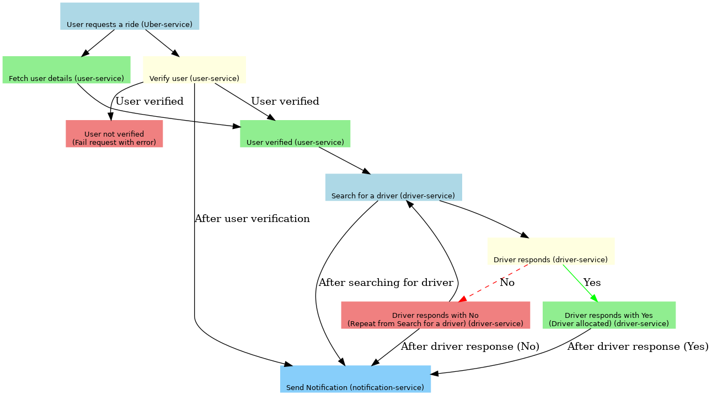

Demonstrates the usage of temporal with self-hosted temporal.

#### Setting up

1. Go to temporal-client => docker compose up.
2. Driver-service, notification-service, user-service needs to be up individually as they are individual microservices. Up them individually
3. Uber service is the service that initiates the workflow. So its meant to ne run last.
4. Go to http://localhost:8080 for temporal UI dashboard to view the workflows.

Usecase diagram

